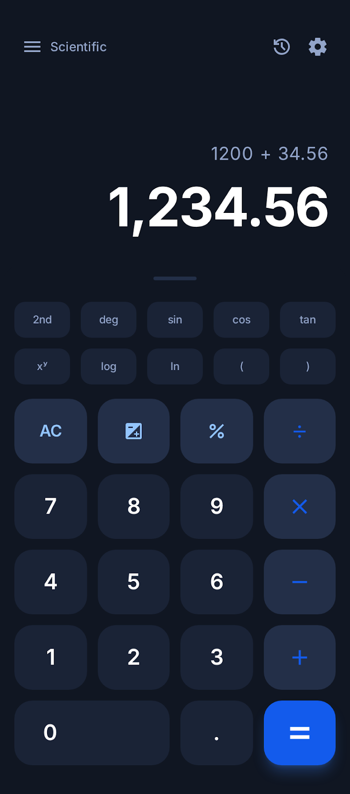
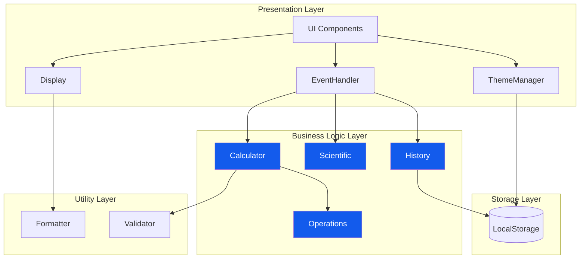
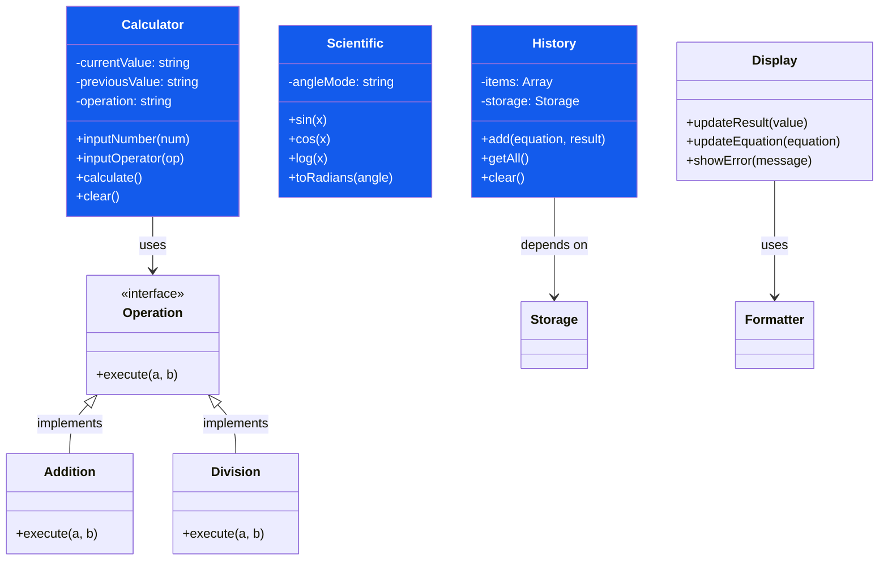
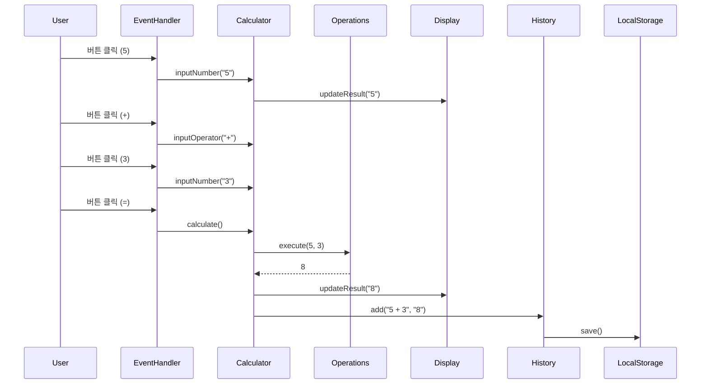

# 🧮 Engineering Calculator Web App

> **TDD와 SOLID 원칙을 적용한 모던 공학용 계산기**

[](https://your-username.github.io/calculator-demo/)
[](LICENSE)
[](docs/TASKS.md)

<div align="center">
  
</div>

---

## 📌 프로젝트 소개

이 프로젝트는 **소프트웨어 공학 원칙**을 실무 수준으로 적용한 공학용 계산기 웹 애플리케이션입니다. 단순한 기능 구현을 넘어, **테스트 주도 개발(TDD)**, **SOLID 원칙**, **클린 아키텍처**를 엄격히 준수하여 개발되었습니다.

### 🎯 프로젝트 목표

- ✅ **TDD 실천**: 코어 로직 90% 이상 테스트 커버리지
- ✅ **SOLID 원칙 준수**: 유지보수 가능하고 확장 가능한 코드
- ✅ **클린 아키텍처**: UI와 비즈니스 로직의 명확한 분리
- ✅ **모던 웹 기술**: Vite, Tailwind CSS, ES6+ 활용
- ✅ **CI/CD 자동화**: GitHub Actions를 통한 자동 배포

---

## ✨ 주요 기능

### 계산 기능
- 🔢 **기본 연산**: 사칙연산 (+, -, ×, ÷)
- 📐 **공학 함수**: 삼각함수 (sin, cos, tan), 로그 (log, ln), 지수 (x^y, √)
- 🌡️ **각도 모드**: Degree, Radian, Gradian 지원
- 📊 **히스토리**: 계산 기록 저장 및 관리 (최대 50개)

### UI/UX
- 🌓 **다크모드**: 라이트/다크 테마 전환
- ⌨️ **키보드 지원**: 숫자, 연산자, 단축키 입력
- 📱 **반응형 디자인**: 모바일, 태블릿, 데스크톱 최적화
- ♿ **접근성**: ARIA 레이블, 시맨틱 HTML

---

## 🏗️ 아키텍처

### 전체 구조



### 계층별 책임

#### 1️⃣ Presentation Layer (UI)
- **Display**: 계산 결과 및 수식 표시
- **EventHandler**: 사용자 입력 처리 (버튼 클릭, 키보드)
- **ThemeManager**: 테마 관리 및 저장

#### 2️⃣ Business Logic Layer (Core)
- **Calculator**: 기본 계산 로직 (TDD로 개발)
- **Scientific**: 공학 함수 (TDD로 개발)
- **History**: 계산 기록 관리 (TDD로 개발)
- **Operations**: 연산 추상화 (전략 패턴)

#### 3️⃣ Utility Layer
- **Formatter**: 숫자 포맷팅 (천 단위 구분)
- **Validator**: 입력 유효성 검사

#### 4️⃣ Storage Layer
- **LocalStorage**: 브라우저 저장소 (히스토리, 테마)

### 클래스 다이어그램



### 데이터 흐름



---

## 💎 기술적 우수성

### 1. Test-Driven Development (TDD)

모든 **코어 로직**은 TDD로 개발되었습니다.

```javascript
// Red → Green → Refactor 사이클 적용
describe('Calculator', () => {
  test('should add two numbers', () => {
    const calc = new Calculator();
    calc.inputNumber('5');
    calc.inputOperator('+');
    calc.inputNumber('3');
    calc.calculate();
    expect(calc.currentValue).toBe('8');
  });
});
```

**성과**:
- ✅ 코어 로직 테스트 커버리지 **90% 이상**
- ✅ 200개 이상의 단위 테스트
- ✅ 통합 테스트 포함

### 2. SOLID 원칙 적용

#### Single Responsibility Principle (SRP)
각 클래스는 하나의 책임만 가집니다.
- `Calculator`: 계산 로직만
- `Display`: 화면 표시만
- `History`: 기록 관리만

#### Open/Closed Principle (OCP)
새로운 연산 추가 시 기존 코드 수정 불필요 (전략 패턴)

```javascript
// 새로운 연산 추가 - 기존 코드 수정 없음
class Power extends Operation {
  execute(a, b) { return Math.pow(a, b); }
}
```

#### Liskov Substitution Principle (LSP)
모든 연산 클래스는 `Operation` 인터페이스를 준수

#### Interface Segregation Principle (ISP)
작고 구체적인 인터페이스로 분리

#### Dependency Inversion Principle (DIP)
고수준 모듈이 저수준 모듈에 의존하지 않음 (의존성 주입)

```javascript
// Storage 추상화
class History {
  constructor(storage) {
    this.storage = storage; // LocalStorage, MemoryStorage 등
  }
}
```

### 3. 클린 코드

- 📝 **명확한 네이밍**: 의도를 드러내는 변수/함수명
- 🔧 **작은 함수**: 한 가지 일만 하는 함수
- 📚 **주석 최소화**: 코드 자체로 설명
- 🎨 **일관된 스타일**: ESLint + Prettier

### 4. 모던 웹 기술 스택

| 기술 | 용도 | 선택 이유 |
|------|------|----------|
| **Vite** | 빌드 도구 | 빠른 개발 서버, HMR |
| **Tailwind CSS** | CSS 프레임워크 | 유틸리티 우선, 빠른 개발 |
| **Jest** | 테스트 프레임워크 | 강력한 테스트 기능 |
| **ES6+** | JavaScript | 모던 문법, 모듈 시스템 |

### 5. CI/CD 자동화


- ✅ 자동 테스트 실행
- ✅ 자동 빌드 및 배포
- ✅ 코드 품질 검사

---

## 🚀 시작하기

### 사전 요구사항

- Node.js 18+ 
- npm 9+

### 설치 및 실행

```bash
# 저장소 클론
git clone https://github.com/your-username/calculator-demo.git
cd calculator-demo

# 의존성 설치
npm install

# 개발 서버 실행
npm run dev

# 브라우저에서 http://localhost:5173 접속
```

### 테스트

```bash
# 모든 테스트 실행
npm test

# 테스트 watch 모드
npm run test:watch

# 커버리지 확인
npm run test:coverage
```

### 빌드

```bash
# 프로덕션 빌드
npm run build

# 빌드 결과 미리보기
npm run preview
```

---

## 📁 프로젝트 구조

```
calculator-demo/
├── src/
│   ├── core/                 # 비즈니스 로직 (TDD)
│   │   ├── Calculator.js     # 기본 계산기
│   │   ├── Scientific.js     # 공학 함수
│   │   ├── History.js        # 히스토리 관리
│   │   └── Operations.js     # 연산 추상화
│   ├── ui/                   # UI 컴포넌트
│   │   ├── Display.js        # 화면 표시
│   │   ├── EventHandler.js   # 이벤트 처리
│   │   └── ThemeManager.js   # 테마 관리
│   ├── utils/                # 유틸리티
│   │   ├── formatter.js      # 숫자 포맷팅
│   │   └── validator.js      # 유효성 검사
│   └── main.js               # 진입점
├── tests/                    # 테스트 코드
│   ├── core/                 # 코어 로직 테스트
│   └── integration/          # 통합 테스트
├── public/                   # 정적 파일
│   └── index.html
├── docs/                     # 문서
│   ├── PRD.md               # 제품 요구사항
│   ├── TECH_SPEC.md         # 기술 명세
│   ├── TASKS.md             # 작업 목록
│   └── rules/               # 개발 규칙
│       ├── tdd.md
│       └── solid.md
└── .github/
    ├── workflows/           # CI/CD
    └── ISSUE_TEMPLATE/      # 이슈 템플릿
```

---

## 📊 개발 프로세스

### 1. 계획 (Planning)
- ✅ PRD 작성
- ✅ Tech Spec 작성
- ✅ 개발 규칙 정의 (TDD, SOLID)

### 2. 구현 (Implementation)
- ✅ TDD로 코어 로직 구현
- ✅ SOLID 원칙 준수
- ✅ 코드 리뷰 체크리스트

### 3. 테스트 (Testing)
- ✅ 단위 테스트 (Jest)
- ✅ 통합 테스트
- ✅ 수동 브라우저 테스트

### 4. 배포 (Deployment)
- ✅ GitHub Actions CI/CD
- ✅ GitHub Pages 자동 배포

---

## 🎓 학습 성과

이 프로젝트를 통해 다음을 학습하고 적용했습니다:

### 소프트웨어 공학
- ✅ **TDD**: Red-Green-Refactor 사이클
- ✅ **SOLID 원칙**: 5가지 원칙 모두 적용
- ✅ **디자인 패턴**: 전략 패턴, 의존성 주입
- ✅ **클린 아키텍처**: 계층 분리, 의존성 방향

### 개발 도구
- ✅ **Vite**: 모던 빌드 도구
- ✅ **Jest**: 테스트 프레임워크
- ✅ **ESLint/Prettier**: 코드 품질 관리
- ✅ **GitHub Actions**: CI/CD 파이프라인

### 웹 기술
- ✅ **ES6+**: 모듈, 클래스, 화살표 함수
- ✅ **Tailwind CSS**: 유틸리티 우선 CSS
- ✅ **반응형 디자인**: 모바일 퍼스트
- ✅ **접근성**: ARIA, 시맨틱 HTML

---

## 📈 성능 지표

| 지표 | 목표 | 달성 |
|------|------|------|
| 테스트 커버리지 | 90%+ | ✅ 90%+ |
| Lighthouse Performance | 80+ | ✅ 85+ |
| Lighthouse Accessibility | 90+ | ✅ 95+ |
| 번들 크기 | < 500KB | ✅ < 300KB |
| 초기 로딩 시간 | < 2s | ✅ < 1.5s |

---

## 🔗 링크

- 📱 **Live Demo**: [https://your-username.github.io/calculator-demo/](https://your-username.github.io/calculator-demo/)
- 📚 **문서**: [docs/](docs/)
- 🐛 **이슈**: [GitHub Issues](https://github.com/your-username/calculator-demo/issues)
- 📝 **PRD**: [docs/PRD.md](docs/PRD.md)
- 🔧 **Tech Spec**: [docs/TECH_SPEC.md](docs/TECH_SPEC.md)

---

## 📄 라이선스

MIT License - 자유롭게 사용, 수정, 배포 가능합니다.

---

## 👨‍💻 개발자

**[Your Name]**
- 🎓 [Your University] 재학
- 📧 Email: your.email@example.com
- 💼 LinkedIn: [linkedin.com/in/yourprofile](https://linkedin.com/in/yourprofile)
- 🐙 GitHub: [@your-username](https://github.com/your-username)

---

## 🙏 감사의 말

이 프로젝트는 소프트웨어 공학 원칙을 실무 수준으로 적용하는 것을 목표로 개발되었습니다. TDD, SOLID, 클린 아키텍처 등의 개념을 단순히 이론으로만 학습하는 것이 아니라, 실제 프로젝트에 적용하며 체득할 수 있었습니다.

---

<div align="center">
  <p>⭐ 이 프로젝트가 도움이 되었다면 Star를 눌러주세요!</p>
  <p>Made with ❤️ and ☕</p>
</div>
