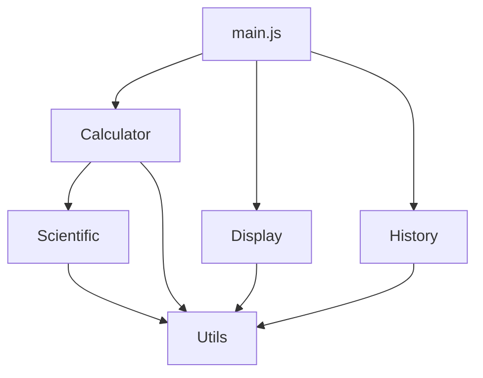

# Tech Spec: 공학용 전자계산기 웹앱

## 문서 정보
- **프로젝트명**: Engineering Calculator Web App
- **버전**: 1.0
- **작성일**: 2025-12-23
- **관련 문서**: [PRD.md](file:///c:/Users/user/Desktop/upstage-demo/calculator-demo/PRD.md)

---

## 1. 기술 스택 개요

### 1.1 핵심 기술
| 기술 | 버전 | 용도 |
|------|------|------|
| HTML5 | - | 마크업 구조 |
| CSS3 | - | 스타일링 |
| JavaScript (ES6+) | ES2020+ | 비즈니스 로직 |
| Tailwind CSS | 3.x | CSS 프레임워크 |

### 1.2 외부 라이브러리
| 라이브러리 | 버전 | 용도 | 로딩 방식 |
|-----------|------|------|----------|
| Inter Font | Latest | 타이포그래피 | Google Fonts CDN |
| Material Symbols | Latest | 아이콘 | Google Fonts CDN |
| Math.js | 11.x (선택) | 고급 수식 파싱 | npm 또는 CDN |

### 1.3 개발 도구
- **코드 에디터**: VS Code
- **버전 관리**: Git
- **패키지 매니저**: npm (선택적)
- **번들러**: Vite (선택적, 프로덕션 빌드용)
- **린터**: ESLint
- **포매터**: Prettier

---

## 2. 아키텍처 설계

### 2.1 전체 구조

```
calculator-demo/
├── index.html              # 메인 HTML 파일
├── css/
│   ├── styles.css         # 커스텀 CSS
│   └── tailwind.config.js # Tailwind 설정 (선택)
├── js/
│   ├── main.js            # 메인 진입점
│   ├── calculator.js      # 계산기 클래스
│   ├── display.js         # 디스플레이 관리
│   ├── scientific.js      # 공학 함수
│   ├── history.js         # 히스토리 관리
│   └── utils.js           # 유틸리티 함수
├── assets/
│   └── icons/             # 로컬 아이콘 (필요시)
├── docs/
│   ├── PRD.md
│   └── TECH_SPEC.md
└── README.md
```

### 2.2 모듈 구조



### 2.3 데이터 흐름

```
User Input → Event Handler → Calculator Logic → Display Update
                ↓
          History Storage
                ↓
          Local Storage
```

---

## 3. 상세 기술 명세

### 3.1 HTML 구조

#### 3.1.1 시맨틱 마크업
```html
<!DOCTYPE html>
<html lang="ko" class="dark">
<head>
  <!-- Meta tags -->
  <!-- Fonts -->
  <!-- Tailwind CSS -->
  <!-- Custom CSS -->
</head>
<body>
  <header>
    <!-- Navigation & Settings -->
  </header>
  
  <main>
    <section id="display">
      <!-- Equation & Result Display -->
    </section>
    
    <section id="keypad">
      <!-- Scientific Functions -->
      <!-- Number Pad -->
    </section>
  </main>
  
  <!-- Scripts -->
</body>
</html>
```

#### 3.1.2 접근성 고려사항
- ARIA 레이블 사용
- 키보드 네비게이션 지원
- 시맨틱 HTML 요소 사용
- 적절한 대비율 유지

### 3.2 CSS 아키텍처

#### 3.2.1 Tailwind CSS 설정
```javascript
// tailwind.config.js
module.exports = {
  darkMode: 'class',
  theme: {
    extend: {
      colors: {
        'primary': '#135bec',
        'background-light': '#f6f6f8',
        'background-dark': '#101622',
        'surface-dark': '#232f48',
        'surface-darker': '#1a2336',
        'text-secondary': '#92a4c9',
      },
      fontFamily: {
        'display': ['Inter', 'sans-serif']
      },
      borderRadius: {
        'DEFAULT': '0.25rem',
        'lg': '0.5rem',
        'xl': '0.75rem',
        '2xl': '1rem',
        '3xl': '1.5rem',
        'full': '9999px'
      },
    },
  },
}
```

#### 3.2.2 커스텀 CSS
```css
/* styles.css */

/* 스크롤바 숨김 */
.no-scrollbar::-webkit-scrollbar {
  display: none;
}
.no-scrollbar {
  -ms-overflow-style: none;
  scrollbar-width: none;
}

/* 버튼 애니메이션 */
.btn-press {
  transition: transform 0.1s ease;
}
.btn-press:active {
  transform: scale(0.95);
}

/* 글로우 효과 */
.glow-blue {
  box-shadow: 0 4px 20px rgba(19, 91, 236, 0.3);
}
```

### 3.3 JavaScript 아키텍처

#### 3.3.1 Calculator 클래스
```javascript
// calculator.js
class Calculator {
  constructor() {
    this.currentValue = '0';
    this.previousValue = '';
    this.operation = null;
    this.equation = '';
    this.angleMode = 'deg'; // deg, rad, grad
    this.memory = 0;
  }

  // 숫자 입력
  inputNumber(num) { }
  
  // 연산자 입력
  inputOperator(op) { }
  
  // 계산 실행
  calculate() { }
  
  // 초기화
  clear() { }
  
  // 부호 변경
  toggleSign() { }
  
  // 백분율
  percentage() { }
  
  // 소수점
  inputDecimal() { }
}
```

#### 3.3.2 Scientific 클래스
```javascript
// scientific.js
class Scientific {
  constructor(angleMode = 'deg') {
    this.angleMode = angleMode;
  }

  // 각도 변환
  toRadians(angle) {
    if (this.angleMode === 'deg') return angle * Math.PI / 180;
    if (this.angleMode === 'grad') return angle * Math.PI / 200;
    return angle;
  }

  // 삼각함수
  sin(x) { return Math.sin(this.toRadians(x)); }
  cos(x) { return Math.cos(this.toRadians(x)); }
  tan(x) { return Math.tan(this.toRadians(x)); }
  
  // 역삼각함수
  asin(x) { }
  acos(x) { }
  atan(x) { }
  
  // 로그/지수
  log(x) { return Math.log10(x); }
  ln(x) { return Math.log(x); }
  pow(x, y) { return Math.pow(x, y); }
  sqrt(x) { return Math.sqrt(x); }
  
  // 상수
  get PI() { return Math.PI; }
  get E() { return Math.E; }
}
```

#### 3.3.3 Display 클래스
```javascript
// display.js
class Display {
  constructor(equationElement, resultElement) {
    this.equationElement = equationElement;
    this.resultElement = resultElement;
  }

  // 결과 표시
  updateResult(value) {
    this.resultElement.textContent = this.formatNumber(value);
  }

  // 수식 표시
  updateEquation(equation) {
    this.equationElement.textContent = equation;
  }

  // 숫자 포맷팅 (천 단위 구분)
  formatNumber(num) {
    if (num === 'Error' || num === 'Invalid') return num;
    
    const parts = num.toString().split('.');
    parts[0] = parts[0].replace(/\B(?=(\d{3})+(?!\d))/g, ',');
    return parts.join('.');
  }

  // 에러 표시
  showError(message) {
    this.resultElement.textContent = message;
  }

  // 초기화
  clear() {
    this.updateEquation('');
    this.updateResult('0');
  }
}
```

#### 3.3.4 History 클래스
```javascript
// history.js
class History {
  constructor(maxItems = 50) {
    this.maxItems = maxItems;
    this.items = this.loadFromStorage();
  }

  // 히스토리 추가
  add(equation, result) {
    const item = {
      id: Date.now(),
      equation,
      result,
      timestamp: new Date().toISOString()
    };
    
    this.items.unshift(item);
    if (this.items.length > this.maxItems) {
      this.items.pop();
    }
    
    this.saveToStorage();
  }

  // 히스토리 가져오기
  getAll() {
    return this.items;
  }

  // 히스토리 삭제
  clear() {
    this.items = [];
    this.saveToStorage();
  }

  // 로컬 스토리지 저장
  saveToStorage() {
    localStorage.setItem('calculator-history', JSON.stringify(this.items));
  }

  // 로컬 스토리지 로드
  loadFromStorage() {
    const data = localStorage.getItem('calculator-history');
    return data ? JSON.parse(data) : [];
  }
}
```

#### 3.3.5 Utils 모듈
```javascript
// utils.js

// 수식 파싱 및 평가
export function evaluateExpression(expression) {
  try {
    // 안전한 수식 평가
    // Math.js 사용 또는 자체 파서 구현
    return Function('"use strict"; return (' + expression + ')')();
  } catch (error) {
    return 'Error';
  }
}

// 유효성 검사
export function isValidNumber(str) {
  return !isNaN(parseFloat(str)) && isFinite(str);
}

// 연산자 우선순위
export function getOperatorPrecedence(op) {
  const precedence = {
    '+': 1,
    '-': 1,
    '*': 2,
    '/': 2,
    '^': 3
  };
  return precedence[op] || 0;
}

// 디바운스
export function debounce(func, wait) {
  let timeout;
  return function executedFunction(...args) {
    const later = () => {
      clearTimeout(timeout);
      func(...args);
    };
    clearTimeout(timeout);
    timeout = setTimeout(later, wait);
  };
}
```

#### 3.3.6 Main 진입점
```javascript
// main.js
import Calculator from './calculator.js';
import Display from './display.js';
import Scientific from './scientific.js';
import History from './history.js';

class App {
  constructor() {
    this.calculator = new Calculator();
    this.scientific = new Scientific();
    this.display = new Display(
      document.querySelector('#equation'),
      document.querySelector('#result')
    );
    this.history = new History();
    
    this.init();
  }

  init() {
    this.setupEventListeners();
    this.loadSettings();
  }

  setupEventListeners() {
    // 숫자 버튼
    document.querySelectorAll('.btn-number').forEach(btn => {
      btn.addEventListener('click', (e) => this.handleNumber(e));
    });

    // 연산자 버튼
    document.querySelectorAll('.btn-operator').forEach(btn => {
      btn.addEventListener('click', (e) => this.handleOperator(e));
    });

    // 공학 함수 버튼
    document.querySelectorAll('.btn-scientific').forEach(btn => {
      btn.addEventListener('click', (e) => this.handleScientific(e));
    });

    // 키보드 입력
    document.addEventListener('keydown', (e) => this.handleKeyboard(e));

    // 테마 토글
    document.querySelector('#theme-toggle')?.addEventListener('click', 
      () => this.toggleTheme()
    );
  }

  handleNumber(e) {
    const num = e.target.dataset.value;
    this.calculator.inputNumber(num);
    this.updateDisplay();
  }

  handleOperator(e) {
    const op = e.target.dataset.value;
    this.calculator.inputOperator(op);
    this.updateDisplay();
  }

  handleScientific(e) {
    const func = e.target.dataset.function;
    const value = parseFloat(this.calculator.currentValue);
    
    let result;
    switch(func) {
      case 'sin': result = this.scientific.sin(value); break;
      case 'cos': result = this.scientific.cos(value); break;
      case 'tan': result = this.scientific.tan(value); break;
      case 'log': result = this.scientific.log(value); break;
      case 'ln': result = this.scientific.ln(value); break;
      // ... 기타 함수
    }
    
    this.calculator.currentValue = result.toString();
    this.updateDisplay();
  }

  handleKeyboard(e) {
    // 키보드 입력 처리
    const key = e.key;
    
    if (/[0-9]/.test(key)) {
      this.calculator.inputNumber(key);
    } else if (['+', '-', '*', '/'].includes(key)) {
      this.calculator.inputOperator(key);
    } else if (key === 'Enter' || key === '=') {
      this.calculator.calculate();
      this.addToHistory();
    } else if (key === 'Escape') {
      this.calculator.clear();
    } else if (key === 'Backspace') {
      this.calculator.backspace();
    }
    
    this.updateDisplay();
  }

  updateDisplay() {
    this.display.updateEquation(this.calculator.equation);
    this.display.updateResult(this.calculator.currentValue);
  }

  addToHistory() {
    this.history.add(
      this.calculator.equation,
      this.calculator.currentValue
    );
  }

  toggleTheme() {
    document.documentElement.classList.toggle('dark');
    localStorage.setItem('theme', 
      document.documentElement.classList.contains('dark') ? 'dark' : 'light'
    );
  }

  loadSettings() {
    const theme = localStorage.getItem('theme') || 'dark';
    if (theme === 'dark') {
      document.documentElement.classList.add('dark');
    }
    
    const angleMode = localStorage.getItem('angleMode') || 'deg';
    this.scientific.angleMode = angleMode;
  }
}

// 앱 초기화
document.addEventListener('DOMContentLoaded', () => {
  new App();
});
```

---

## 4. 상태 관리

### 4.1 애플리케이션 상태
```javascript
const AppState = {
  // 계산기 상태
  calculator: {
    currentValue: '0',
    previousValue: '',
    operation: null,
    equation: '',
    isNewInput: true
  },
  
  // 설정
  settings: {
    theme: 'dark', // 'light' | 'dark'
    angleMode: 'deg', // 'deg' | 'rad' | 'grad'
    decimalPlaces: 10,
    soundEnabled: false
  },
  
  // UI 상태
  ui: {
    isHistoryOpen: false,
    isSettingsOpen: false,
    activeMode: 'scientific' // 'basic' | 'scientific'
  }
};
```

### 4.2 로컬 스토리지 스키마
```javascript
// localStorage keys
const STORAGE_KEYS = {
  HISTORY: 'calculator-history',
  SETTINGS: 'calculator-settings',
  THEME: 'theme',
  ANGLE_MODE: 'angleMode'
};

// History item structure
{
  id: number,
  equation: string,
  result: string,
  timestamp: string (ISO 8601)
}

// Settings structure
{
  theme: 'light' | 'dark',
  angleMode: 'deg' | 'rad' | 'grad',
  decimalPlaces: number,
  soundEnabled: boolean
}
```

---

## 5. 이벤트 시스템

### 5.1 이벤트 타입
```javascript
const EVENTS = {
  // 입력 이벤트
  NUMBER_INPUT: 'number-input',
  OPERATOR_INPUT: 'operator-input',
  FUNCTION_INPUT: 'function-input',
  
  // 계산 이벤트
  CALCULATE: 'calculate',
  CLEAR: 'clear',
  BACKSPACE: 'backspace',
  
  // UI 이벤트
  THEME_CHANGE: 'theme-change',
  MODE_CHANGE: 'mode-change',
  HISTORY_TOGGLE: 'history-toggle',
  
  // 에러 이벤트
  ERROR: 'error'
};
```

### 5.2 이벤트 핸들러
```javascript
class EventBus {
  constructor() {
    this.listeners = {};
  }

  on(event, callback) {
    if (!this.listeners[event]) {
      this.listeners[event] = [];
    }
    this.listeners[event].push(callback);
  }

  emit(event, data) {
    if (this.listeners[event]) {
      this.listeners[event].forEach(callback => callback(data));
    }
  }

  off(event, callback) {
    if (this.listeners[event]) {
      this.listeners[event] = this.listeners[event]
        .filter(cb => cb !== callback);
    }
  }
}
```

---

## 6. 수식 파싱 및 평가

### 6.1 파싱 전략

#### Option 1: Math.js 사용 (권장)
```javascript
import { evaluate } from 'mathjs';

function calculateExpression(expr) {
  try {
    return evaluate(expr);
  } catch (error) {
    return 'Error';
  }
}
```

#### Option 2: 자체 파서 구현
```javascript
class ExpressionParser {
  constructor() {
    this.operators = {
      '+': (a, b) => a + b,
      '-': (a, b) => a - b,
      '*': (a, b) => a * b,
      '/': (a, b) => a / b,
      '^': (a, b) => Math.pow(a, b)
    };
  }

  // Shunting Yard 알고리즘
  parse(expression) {
    // 중위 표기법 → 후위 표기법 변환
  }

  // 후위 표기법 평가
  evaluate(tokens) {
    // 스택 기반 평가
  }
}
```

### 6.2 에러 처리
```javascript
function safeEvaluate(expression) {
  try {
    // 입력 검증
    if (!isValidExpression(expression)) {
      throw new Error('Invalid expression');
    }

    // 계산
    const result = evaluate(expression);

    // 결과 검증
    if (!isFinite(result)) {
      return 'Error';
    }
    if (isNaN(result)) {
      return 'Invalid';
    }

    return result;
  } catch (error) {
    console.error('Calculation error:', error);
    return 'Error';
  }
}

function isValidExpression(expr) {
  // 괄호 균형 확인
  const openCount = (expr.match(/\(/g) || []).length;
  const closeCount = (expr.match(/\)/g) || []).length;
  if (openCount !== closeCount) return false;

  // 연속된 연산자 확인
  if (/[+\-*/]{2,}/.test(expr)) return false;

  return true;
}
```

---

## 7. 성능 최적화

### 7.1 렌더링 최적화
```javascript
// 디바운스를 이용한 입력 처리
const debouncedUpdate = debounce(() => {
  updateDisplay();
}, 16); // ~60fps

// Virtual DOM 대신 직접 DOM 조작 최소화
class DOMCache {
  constructor() {
    this.cache = new Map();
  }

  get(selector) {
    if (!this.cache.has(selector)) {
      this.cache.set(selector, document.querySelector(selector));
    }
    return this.cache.get(selector);
  }
}
```

### 7.2 메모리 관리
```javascript
// 히스토리 제한
const MAX_HISTORY_ITEMS = 50;

// 이벤트 리스너 정리
class Component {
  constructor() {
    this.listeners = [];
  }

  addEventListener(element, event, handler) {
    element.addEventListener(event, handler);
    this.listeners.push({ element, event, handler });
  }

  destroy() {
    this.listeners.forEach(({ element, event, handler }) => {
      element.removeEventListener(event, handler);
    });
    this.listeners = [];
  }
}
```

### 7.3 번들 최적화
```javascript
// vite.config.js (프로덕션 빌드용)
export default {
  build: {
    minify: 'terser',
    terserOptions: {
      compress: {
        drop_console: true
      }
    },
    rollupOptions: {
      output: {
        manualChunks: {
          'vendor': ['mathjs'] // 벤더 코드 분리
        }
      }
    }
  }
}
```

---

## 8. 테스트 전략

### 8.1 단위 테스트
```javascript
// calculator.test.js
describe('Calculator', () => {
  let calc;

  beforeEach(() => {
    calc = new Calculator();
  });

  test('should add two numbers', () => {
    calc.inputNumber('5');
    calc.inputOperator('+');
    calc.inputNumber('3');
    calc.calculate();
    expect(calc.currentValue).toBe('8');
  });

  test('should handle division by zero', () => {
    calc.inputNumber('5');
    calc.inputOperator('/');
    calc.inputNumber('0');
    calc.calculate();
    expect(calc.currentValue).toBe('Error');
  });
});

// scientific.test.js
describe('Scientific', () => {
  let sci;

  beforeEach(() => {
    sci = new Scientific('deg');
  });

  test('should calculate sin(30) in degrees', () => {
    expect(sci.sin(30)).toBeCloseTo(0.5, 5);
  });

  test('should calculate log(100)', () => {
    expect(sci.log(100)).toBe(2);
  });
});
```

### 8.2 통합 테스트
```javascript
// app.test.js
describe('App Integration', () => {
  test('should perform complete calculation flow', () => {
    // 1. 숫자 입력
    // 2. 연산자 입력
    // 3. 숫자 입력
    // 4. 계산
    // 5. 결과 확인
    // 6. 히스토리 확인
  });
});
```

### 8.3 E2E 테스트
```javascript
// e2e/calculator.spec.js (Playwright)
test('basic calculation', async ({ page }) => {
  await page.goto('http://localhost:3000');
  
  await page.click('[data-value="5"]');
  await page.click('[data-value="+"]');
  await page.click('[data-value="3"]');
  await page.click('[data-value="="]');
  
  const result = await page.textContent('#result');
  expect(result).toBe('8');
});
```

---

## 9. 보안 고려사항

### 9.1 XSS 방지
```javascript
// 사용자 입력 이스케이프
function escapeHTML(str) {
  const div = document.createElement('div');
  div.textContent = str;
  return div.innerHTML;
}

// textContent 사용 (innerHTML 대신)
element.textContent = userInput;
```

### 9.2 안전한 수식 평가
```javascript
// eval() 사용 금지
// Function() 생성자 사용 시 입력 검증
function safeEval(expr) {
  // 허용된 문자만 포함하는지 확인
  const allowedChars = /^[0-9+\-*/.() ]+$/;
  if (!allowedChars.test(expr)) {
    throw new Error('Invalid characters in expression');
  }
  
  // Math.js 같은 안전한 라이브러리 사용
  return evaluate(expr);
}
```

### 9.3 CSP (Content Security Policy)
```html
<meta http-equiv="Content-Security-Policy" 
      content="default-src 'self'; 
               script-src 'self' https://cdn.tailwindcss.com; 
               style-src 'self' 'unsafe-inline' https://fonts.googleapis.com; 
               font-src https://fonts.gstatic.com;">
```

---

## 10. 배포 전략

### 10.1 개발 환경
```bash
# 로컬 개발 서버 (Vite 사용 시)
npm run dev

# 또는 간단한 HTTP 서버
python -m http.server 8000
# 또는
npx serve .
```

### 10.2 프로덕션 빌드
```bash
# Vite 사용 시
npm run build

# 빌드 결과물
dist/
├── index.html
├── assets/
│   ├── index-[hash].js
│   └── index-[hash].css
└── ...
```

### 10.3 GitHub Pages 배포

#### 10.3.1 저장소 설정
1. GitHub 저장소 생성
2. Settings → Pages → Source를 "GitHub Actions"로 설정
3. 커스텀 도메인 설정 (선택사항)

#### 10.3.2 배포 URL
- **기본 URL**: `https://<username>.github.io/<repository-name>/`
- **커스텀 도메인**: `https://your-domain.com` (선택사항)

#### 10.3.3 Base Path 설정
GitHub Pages에서 서브 경로로 배포되는 경우 base path 설정 필요:

```javascript
// vite.config.js
export default {
  base: '/calculator-demo/', // 저장소 이름과 일치
  build: {
    outDir: 'dist',
    assetsDir: 'assets'
  }
}
```

### 10.4 GitHub Actions CI/CD 파이프라인

#### 10.4.1 워크플로우 파일
```yaml
# .github/workflows/deploy.yml
name: Deploy to GitHub Pages

on:
  push:
    branches: [main]
  pull_request:
    branches: [main]
  workflow_dispatch: # 수동 실행 허용

# GitHub Pages 배포 권한 설정
permissions:
  contents: read
  pages: write
  id-token: write

# 동시 배포 방지
concurrency:
  group: "pages"
  cancel-in-progress: false

jobs:
  # 빌드 작업
  build:
    runs-on: ubuntu-latest
    steps:
      - name: Checkout
        uses: actions/checkout@v4

      - name: Setup Node.js
        uses: actions/setup-node@v4
        with:
          node-version: '20'
          cache: 'npm'

      - name: Install dependencies
        run: npm ci

      - name: Run tests
        run: npm test
        continue-on-error: true # 테스트 실패해도 빌드 계속

      - name: Build
        run: npm run build

      - name: Setup Pages
        uses: actions/configure-pages@v4

      - name: Upload artifact
        uses: actions/upload-pages-artifact@v3
        with:
          path: './dist'

  # 배포 작업
  deploy:
    environment:
      name: github-pages
      url: ${{ steps.deployment.outputs.page_url }}
    runs-on: ubuntu-latest
    needs: build
    steps:
      - name: Deploy to GitHub Pages
        id: deployment
        uses: actions/deploy-pages@v4
```

#### 10.4.2 간단한 버전 (Vite 미사용 시)
정적 HTML/CSS/JS만 사용하는 경우:

```yaml
# .github/workflows/deploy-static.yml
name: Deploy Static Site

on:
  push:
    branches: [main]
  workflow_dispatch:

permissions:
  contents: read
  pages: write
  id-token: write

concurrency:
  group: "pages"
  cancel-in-progress: false

jobs:
  deploy:
    environment:
      name: github-pages
      url: ${{ steps.deployment.outputs.page_url }}
    runs-on: ubuntu-latest
    steps:
      - name: Checkout
        uses: actions/checkout@v4

      - name: Setup Pages
        uses: actions/configure-pages@v4

      - name: Upload artifact
        uses: actions/upload-pages-artifact@v3
        with:
          path: '.' # 루트 디렉토리 전체 배포

      - name: Deploy to GitHub Pages
        id: deployment
        uses: actions/deploy-pages@v4
```

### 10.5 배포 프로세스

#### 10.5.1 초기 배포
```bash
# 1. 코드 커밋
git add .
git commit -m "Initial commit"

# 2. GitHub에 푸시
git push origin main

# 3. GitHub Actions 자동 실행
# 4. 배포 완료 후 URL 확인
```

#### 10.5.2 업데이트 배포
```bash
# 코드 수정 후
git add .
git commit -m "Update calculator features"
git push origin main

# GitHub Actions가 자동으로 빌드 및 배포
```

### 10.6 배포 확인

#### 10.6.1 GitHub Actions 로그 확인
1. GitHub 저장소 → Actions 탭
2. 최근 워크플로우 실행 확인
3. 각 단계별 로그 확인

#### 10.6.2 배포 상태 확인
1. Settings → Pages
2. "Your site is live at ..." 메시지 확인
3. URL 클릭하여 사이트 확인

### 10.7 트러블슈팅

#### 10.7.1 404 에러
- Base path 설정 확인
- 파일 경로 대소문자 확인
- GitHub Pages 설정 확인

#### 10.7.2 빌드 실패
- package.json 스크립트 확인
- Node.js 버전 호환성 확인
- 의존성 설치 확인

#### 10.7.3 권한 에러
- Repository Settings → Actions → General
- Workflow permissions를 "Read and write permissions"로 설정

---

## 11. 브라우저 호환성

### 11.1 타겟 브라우저
```json
{
  "browserslist": [
    "last 2 Chrome versions",
    "last 2 Firefox versions",
    "last 2 Safari versions",
    "last 2 Edge versions",
    "iOS >= 12",
    "Android >= 8"
  ]
}
```

### 11.2 폴리필
```javascript
// 필요한 경우 core-js 사용
import 'core-js/stable';
import 'regenerator-runtime/runtime';
```

### 11.3 기능 감지
```javascript
// LocalStorage 지원 확인
function isLocalStorageAvailable() {
  try {
    const test = '__test__';
    localStorage.setItem(test, test);
    localStorage.removeItem(test);
    return true;
  } catch (e) {
    return false;
  }
}
```

---

## 12. 모니터링 및 분석

### 12.1 에러 추적
```javascript
// 전역 에러 핸들러
window.addEventListener('error', (event) => {
  console.error('Global error:', event.error);
  // 에러 리포팅 서비스로 전송 (Sentry 등)
});

window.addEventListener('unhandledrejection', (event) => {
  console.error('Unhandled promise rejection:', event.reason);
});
```

### 12.2 성능 모니터링
```javascript
// Performance API 사용
const perfData = performance.getEntriesByType('navigation')[0];
console.log('Page load time:', perfData.loadEventEnd - perfData.fetchStart);

// 커스텀 메트릭
performance.mark('calculation-start');
// ... 계산 수행
performance.mark('calculation-end');
performance.measure('calculation', 'calculation-start', 'calculation-end');
```

### 12.3 사용자 분석 (선택)
```javascript
// Google Analytics 4
gtag('event', 'calculation', {
  'event_category': 'calculator',
  'event_label': operation,
  'value': 1
});
```

---

## 13. 개발 가이드라인

### 13.1 코딩 컨벤션
```javascript
// ESLint 설정
{
  "extends": ["eslint:recommended"],
  "env": {
    "browser": true,
    "es2020": true
  },
  "parserOptions": {
    "ecmaVersion": 2020,
    "sourceType": "module"
  },
  "rules": {
    "indent": ["error", 2],
    "quotes": ["error", "single"],
    "semi": ["error", "always"]
  }
}
```

### 13.2 네이밍 컨벤션
- **클래스**: PascalCase (예: `Calculator`, `Display`)
- **함수/메서드**: camelCase (예: `inputNumber`, `calculate`)
- **상수**: UPPER_SNAKE_CASE (예: `MAX_HISTORY_ITEMS`)
- **파일**: kebab-case (예: `calculator.js`, `display.js`)

### 13.3 주석 가이드
```javascript
/**
 * 두 숫자를 더합니다.
 * @param {number} a - 첫 번째 숫자
 * @param {number} b - 두 번째 숫자
 * @returns {number} 합계
 */
function add(a, b) {
  return a + b;
}
```

---

## 14. 향후 기술 개선 사항

### 14.1 단기 (1-3개월)
- [ ] PWA 변환 (Service Worker, Manifest)
- [ ] 오프라인 지원
- [ ] 키보드 단축키 확장
- [ ] 애니메이션 개선

### 14.2 중기 (3-6개월)
- [ ] TypeScript 마이그레이션
- [ ] React/Vue 프레임워크 도입
- [ ] 그래프 그리기 기능
- [ ] 단위 변환 기능

### 14.3 장기 (6개월+)
- [ ] 모바일 앱 (React Native)
- [ ] 클라우드 동기화
- [ ] 협업 기능
- [ ] AI 기반 수식 인식

---

## 부록 A: 개발 체크리스트

### Phase 1: 프로젝트 설정
- [ ] Git 저장소 초기화
- [ ] 프로젝트 구조 생성
- [ ] 의존성 설치
- [ ] ESLint/Prettier 설정

### Phase 2: HTML/CSS
- [ ] HTML 마크업 작성
- [ ] Tailwind CSS 설정
- [ ] 다크모드 구현
- [ ] 반응형 레이아웃

### Phase 3: JavaScript 기본
- [ ] Calculator 클래스 구현
- [ ] Display 클래스 구현
- [ ] 이벤트 핸들러 설정
- [ ] 기본 계산 로직

### Phase 4: 공학 함수
- [ ] Scientific 클래스 구현
- [ ] 삼각함수 구현
- [ ] 로그/지수 함수
- [ ] 각도 모드 전환

### Phase 5: 부가 기능
- [ ] History 클래스 구현
- [ ] 로컬 스토리지 연동
- [ ] 키보드 입력 지원
- [ ] 설정 기능

### Phase 6: 테스트
- [ ] 단위 테스트 작성
- [ ] 통합 테스트
- [ ] 브라우저 테스트
- [ ] 성능 테스트

### Phase 7: 배포
- [ ] 프로덕션 빌드
- [ ] 호스팅 설정
- [ ] CI/CD 파이프라인
- [ ] 문서화

---

## 부록 B: API 레퍼런스

### Calculator API
```typescript
class Calculator {
  currentValue: string;
  previousValue: string;
  operation: string | null;
  equation: string;
  
  inputNumber(num: string): void;
  inputOperator(op: string): void;
  calculate(): void;
  clear(): void;
  toggleSign(): void;
  percentage(): void;
  inputDecimal(): void;
  backspace(): void;
}
```

### Scientific API
```typescript
class Scientific {
  angleMode: 'deg' | 'rad' | 'grad';
  
  sin(x: number): number;
  cos(x: number): number;
  tan(x: number): number;
  asin(x: number): number;
  acos(x: number): number;
  atan(x: number): number;
  log(x: number): number;
  ln(x: number): number;
  pow(x: number, y: number): number;
  sqrt(x: number): number;
  
  readonly PI: number;
  readonly E: number;
}
```

### Display API
```typescript
class Display {
  updateResult(value: string): void;
  updateEquation(equation: string): void;
  formatNumber(num: number | string): string;
  showError(message: string): void;
  clear(): void;
}
```

### History API
```typescript
interface HistoryItem {
  id: number;
  equation: string;
  result: string;
  timestamp: string;
}

class History {
  items: HistoryItem[];
  maxItems: number;
  
  add(equation: string, result: string): void;
  getAll(): HistoryItem[];
  clear(): void;
  saveToStorage(): void;
  loadFromStorage(): HistoryItem[];
}
```

---

## 참고 자료

### 공식 문서
- [MDN Web Docs](https://developer.mozilla.org/)
- [Tailwind CSS](https://tailwindcss.com/docs)
- [Math.js](https://mathjs.org/docs/)
- [ES6+ Features](https://es6-features.org/)

### 도구
- [VS Code](https://code.visualstudio.com/)
- [ESLint](https://eslint.org/)
- [Prettier](https://prettier.io/)
- [Vite](https://vitejs.dev/)

### 학습 자료
- [JavaScript.info](https://javascript.info/)
- [CSS-Tricks](https://css-tricks.com/)
- [Web.dev](https://web.dev/)

---

**문서 버전**: 1.0  
**최종 수정일**: 2025-12-23  
**작성자**: AI Assistant  
**검토 상태**: 검토 대기
